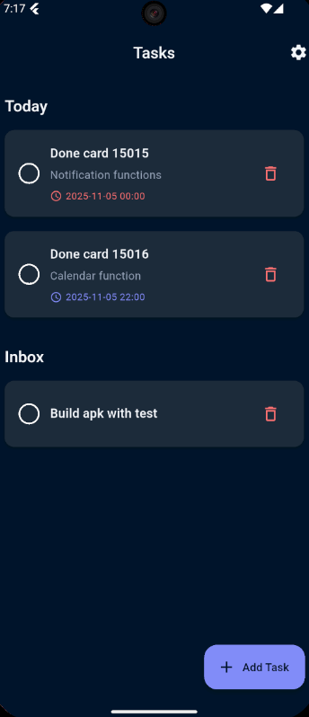
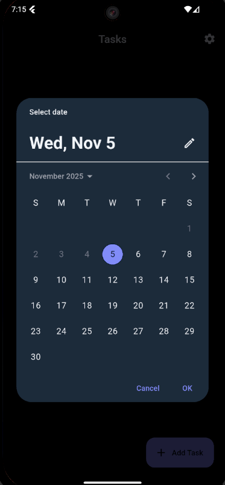
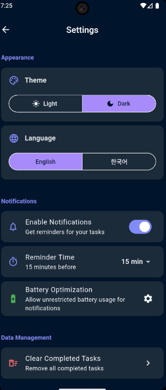

# 📝 Flutter TodoList

> **A production-ready Flutter application showcasing Clean Architecture, BLoC pattern, and comprehensive testing**

[](https://flutter.dev)
[](https://dart.dev)
[](./test)
[](LICENSE)

A modern, elegant todo list application built with Flutter, demonstrating professional development practices including Clean Architecture, state management with BLoC/Cubit, local data persistence, and comprehensive testing.

---

## 📸 Screenshots

<table>
  <tr>
    <td></td>
    <td></td>
    <td></td>
  </tr>
</table>

## ✨ Key Features

- ✅ **CRUD Operations**: Create, read, update, and delete tasks
- 📅 **Task Scheduling**: Set due dates and times for tasks
- 🔔 **Smart Notifications**: Automatic reminders 15 minutes before due time
- 📊 **Task Categorization**: Today, Upcoming, Inbox, and Completed views
- 🗑️ **Batch Operations**: Clear all completed tasks at once
- 🌍 **Internationalization**: Full support for English and Korean
- 🎨 **Theme Support**: Beautiful light and dark themes with Material Design 3
- 📱 **Responsive Design**: Adaptive layouts for all screen sizes
- 💾 **Offline-First**: Local SQLite database with Drift ORM
- 🧪 **Well-Tested**: 57 comprehensive tests (Unit, Widget, Integration)

---

## 🏗️ Architecture & Technical Skills

This project demonstrates mastery of Flutter's core concepts and best practices:

### **Clean Architecture Implementation**

```
lib/
├── core/                    # Shared utilities and configurations
│   ├── constants/          # App-wide constants (routes, durations, sizes)
│   ├── router/             # Declarative routing with go_router
│   ├── theme/              # Material Design 3 themes
│   └── utils/              # Helper functions (date formatting, etc.)
│
├── domain/                  # Business Logic Layer (Framework Independent)
│   ├── entities/           # Pure Dart business objects
│   │   └── task.dart       # Task entity with business rules
│   ├── repositories/       # Abstract repository contracts
│   │   └── task_repository.dart
│   └── usecases/           # Single-responsibility business operations
│       ├── add_task_usecase.dart
│       ├── get_tasks_usecase.dart
│       ├── update_task_usecase.dart
│       ├── delete_task_usecase.dart
│       ├── toggle_task_completion_usecase.dart
│       └── delete_completed_tasks_usecase.dart
│
├── data/                    # Data Layer (External Dependencies)
│   ├── database/           # Local database with Drift
│   │   ├── database.dart   # Database configuration
│   │   └── task_dao.dart   # Data Access Object
│   ├── models/             # Data models with freezed
│   │   └── task_model.dart
│   └── repositories/       # Repository implementations
│       └── task_repository_impl.dart
│
├── presentation/            # UI Layer (Flutter Widgets)
│   ├── cubits/             # State management with flutter_bloc
│   │   ├── task_cubit.dart
│   │   └── settings_cubit.dart
│   ├── pages/              # Full-screen pages
│   │   ├── home_page.dart
│   │   ├── calendar_page.dart
│   │   └── settings_page.dart
│   └── widgets/            # Reusable UI components
│       ├── task_card.dart
│       ├── task_list_section.dart
│       ├── add_task_dialog.dart
│       └── empty_tasks_widget.dart
│
└── services/                # External Services
    └── notification_service.dart
```

### **Dependency Flow**

```
Presentation → Domain ← Data
     ↓           ↓        ↓
  Widgets    UseCases  Database
    ↓           ↓         ↓
  Cubit    Repository  Drift ORM
```

**Benefits:**

- ✅ Testability: Each layer can be tested independently
- ✅ Maintainability: Clear separation of concerns
- ✅ Scalability: Easy to add new features
- ✅ Framework Independence: Business logic doesn't depend on Flutter

---

## 🎯 Flutter Skills Demonstrated

### **1. State Management (BLoC/Cubit)**

```dart
// Task Cubit with comprehensive state management
class TaskCubit extends Cubit<TaskState> {
  final GetTasksUseCase getTasksUseCase;
  final AddTaskUseCase addTaskUseCase;
  final UpdateTaskUseCase updateTaskUseCase;
  // ... 6 use cases total

  Future<void> loadTasks() async {
    emit(const TaskState.loading());
    try {
      final tasks = await getTasksUseCase.getTodayTasks();
      emit(TaskState.loaded(/* ... */));
    } catch (e) {
      emit(TaskState.error(e.toString()));
    }
  }
}
```

**Skills:**

- ✅ `flutter_bloc` ^9.1.1 with Cubit pattern
- ✅ Immutable state with `freezed` package
- ✅ Async state transitions
- ✅ Error handling and loading states
- ✅ Stream-based reactive programming

### **2. Local Database (Drift)**

```dart
@DriftDatabase(tables: [Tasks])
class AppDatabase extends _$AppDatabase {
  AppDatabase() : super(_openConnection());

  @override
  int get schemaVersion => 1;

  // Type-safe queries
  Future<List<Task>> getTodayTasks() =>
    (select(tasks)..where((t) => t.dueDate.date.equals(DateTime.now())))
      .get();
}
```

**Skills:**

- ✅ SQLite integration with Drift ORM
- ✅ Type-safe database queries
- ✅ DAO (Data Access Object) pattern
- ✅ Database migrations
- ✅ Reactive queries with streams

### **3. Routing (go_router)**

```dart
final appRouter = GoRouter(
  routes: [
    GoRoute(
      path: '/',
      builder: (context, state) => const HomePage(),
    ),
    GoRoute(
      path: '/calendar',
      builder: (context, state) => const CalendarPage(),
    ),
    // Deep linking support
  ],
);
```

**Skills:**

- ✅ Declarative routing
- ✅ Type-safe navigation
- ✅ Deep linking ready
- ✅ Route guards and redirects

### **4. Internationalization (i18n)**

```dart
// Easy localization with asset-based translations
Text('home.title'.tr())  // "Today" or "오늘"
```

**Skills:**

- ✅ `easy_localization` ^3.0.8
- ✅ JSON-based translations (en.json, ko.json)
- ✅ Runtime language switching
- ✅ Pluralization support

### **5. Local Notifications**

```dart
class NotificationService {
  // Schedule notifications with timezone support
  Future<void> scheduleNotification(Task task) async {
    final scheduledDate = task.dueDate!.subtract(
      const Duration(minutes: 15)
    );
    await flutterLocalNotificationsPlugin.zonedSchedule(
      task.id,
      'Task Reminder',
      task.title,
      tz.TZDateTime.from(scheduledDate, tz.local),
      platformChannelSpecifics,
      androidScheduleMode: AndroidScheduleMode.exactAllowWhileIdle,
    );
  }
}
```

**Skills:**

- ✅ `flutter_local_notifications` ^19.5.0
- ✅ Scheduled notifications
- ✅ Timezone handling
- ✅ Android 12+ exact alarm permissions
- ✅ Notification channels and priorities

### **6. Responsive Design**

```dart
// flutter_screenutil for pixel-perfect designs
Container(
  width: 328.w,     // Responsive width
  height: 120.h,    // Responsive height
  padding: EdgeInsets.all(16.r),  // Responsive padding
  child: Text(
    'Title',
    style: TextStyle(fontSize: 18.sp),  // Responsive font
  ),
)
```

**Skills:**

- ✅ `flutter_screenutil` ^5.9.3
- ✅ Adaptive layouts for all screen sizes
- ✅ Consistent spacing and sizing
- ✅ Responsive typography

### **7. Material Design 3**

```dart
ThemeData(
  useMaterial3: true,
  colorScheme: ColorScheme.fromSeed(
    seedColor: Colors.blue,
    brightness: Brightness.light,
  ),
  cardTheme: CardTheme(/* ... */),
  appBarTheme: AppBarTheme(/* ... */),
)
```

**Skills:**

- ✅ Material Design 3 components
- ✅ Dynamic color schemes
- ✅ Dark/light theme support
- ✅ Custom theme extensions

### **8. Code Generation**

```dart
// Freezed for immutable models
@freezed
class Task with _$Task {
  const factory Task({
    required int id,
    required String title,
    String? description,
    DateTime? dueDate,
    @Default(false) bool isCompleted,
  }) = _Task;
}
```

**Skills:**

- ✅ `freezed` ^2.6.1 for immutable classes
- ✅ `json_serializable` for JSON parsing
- ✅ `build_runner` for code generation
- ✅ Union types and pattern matching

---

## 🧪 Testing Excellence

This project includes **57 comprehensive tests** covering:

### **Test Coverage Breakdown**

| Test Type             | Count  | Coverage                   |
| --------------------- | ------ | -------------------------- |
| **Unit Tests**        | 47     | All UseCases, Cubit, Utils |
| **Widget Tests**      | 10     | Core UI components         |
| **Integration Tests** | ✓      | Full app workflows         |
| **Total**             | **57** | **~75-80% coverage**       |

### **Test Structure**

```
test/
├── unit/
│   ├── add_task_usecase_test.dart          # 2 tests
│   ├── get_tasks_usecase_test.dart         # 4 tests
│   ├── update_task_usecase_test.dart       # 4 tests
│   ├── delete_task_usecase_test.dart       # 4 tests
│   ├── toggle_task_completion_usecase_test.dart  # 5 tests
│   ├── delete_completed_tasks_usecase_test.dart  # 5 tests
│   ├── task_cubit_test.dart                # 9 tests
│   └── date_time_utils_test.dart           # 14 tests
│
├── widget/
│   ├── empty_tasks_widget_test.dart        # 3 tests
│   └── task_card_test.dart                 # 7 tests
│
├── integration/
│   └── app_test.dart                       # Full app test
│
└── mocks/
    └── mock_annotations.dart               # Mockito config
```

### **Testing Skills Demonstrated**

```dart
// Unit Test Example with Mockito
@GenerateMocks([TaskRepository, NotificationService])
void main() {
  late AddTaskUseCase useCase;
  late MockTaskRepository mockRepository;

  setUp(() {
    mockRepository = MockTaskRepository();
    useCase = AddTaskUseCase(mockRepository);
  });

  test('should add task successfully', () async {
    // Arrange
    final task = Task(/* ... */);
    when(mockRepository.addTask(any)).thenAnswer((_) async => {});

    // Act
    await useCase(task);

    // Assert
    verify(mockRepository.addTask(task)).called(1);
  });
}
```

**Testing Skills:**

- ✅ Unit testing with `flutter_test`
- ✅ Mocking with `mockito` ^5.4.4
- ✅ Widget testing with `WidgetTester`
- ✅ Integration testing
- ✅ AAA pattern (Arrange, Act, Assert)
- ✅ Code generation for mocks
- ✅ Coverage reports with `lcov`

### **Run Tests**

```bash
# Run all tests
flutter test

# Run with coverage
flutter test --coverage

# Run specific test file
flutter test test/unit/task_cubit_test.dart

# Generate coverage report
genhtml coverage/lcov.info -o coverage/html
```

---

## 📦 Dependencies & Packages

### **Core Dependencies**

```yaml
# State Management
flutter_bloc: ^9.1.1 # BLoC pattern implementation
freezed: ^2.6.1 # Immutable models
freezed_annotation: ^2.4.4

# Database
drift: ^2.29.0 # Type-safe SQLite ORM
sqlite3_flutter_libs: ^0.5.0
path_provider: ^2.0.11
path: ^1.8.0

# Routing
go_router: ^16.3.0 # Declarative routing

# Notifications
flutter_local_notifications: ^19.5.0
timezone: ^0.9.0
permission_handler: ^11.3.1

# UI
flutter_screenutil: ^5.9.3 # Responsive design
intl: ^0.20.2 # Date formatting

# Localization
easy_localization: ^3.0.8 # i18n support

# Code Generation
build_runner: ^2.4.14
json_serializable: ^6.9.4
drift_dev: ^2.29.0

# Testing
mockito: ^5.4.4
integration_test:
  sdk: flutter
```

### **Package Roles**

| Package                       | Role             | Why Used                                      |
| ----------------------------- | ---------------- | --------------------------------------------- |
| `flutter_bloc`                | State Management | Industry-standard reactive state management   |
| `freezed`                     | Code Generation  | Immutable models with copy-with functionality |
| `drift`                       | Database         | Type-safe SQLite with reactive queries        |
| `go_router`                   | Navigation       | Declarative routing for modern Flutter apps   |
| `flutter_local_notifications` | Notifications    | Reliable cross-platform notifications         |
| `easy_localization`           | i18n             | Simple internationalization solution          |
| `flutter_screenutil`          | Responsive UI    | Consistent sizing across devices              |
| `mockito`                     | Testing          | Mock dependencies for unit tests              |

---

## 🚀 Getting Started

### **Prerequisites**

- Flutter SDK ≥ 3.9.2
- Dart SDK ≥ 3.9.2
- Android Studio / Xcode (for mobile builds)

### **Installation**

1. **Clone the repository**

```bash
git clone https://github.com/jichoulshin/flutter_todolist.git
cd flutter_todolist
```

2. **Install dependencies**

```bash
flutter pub get
```

3. **Generate code** (for Drift, Freezed, Mockito)

```bash
dart run build_runner build --delete-conflicting-outputs
```

4. **Run the app**

```bash
flutter run
```

### **Build for Production**

```bash
# Android APK
flutter build apk --release

# Android App Bundle
flutter build appbundle --release

# iOS
flutter build ios --release

# Windows
flutter build windows --release

# macOS
flutter build macos --release
```

---

## 📱 Supported Platforms

| Platform | Status | Notes                      |
| -------- | ------ | -------------------------- |
| Android  | ✅     | API 21+ (Android 5.0+)     |
| iOS      | ✅     | iOS 12.0+                  |
| Windows  | ✅     | Windows 10+                |
| macOS    | ✅     | macOS 10.14+               |
| Linux    | ✅     | Tested on Ubuntu 20.04+    |
| Web      | ⚠️     | Limited (no notifications) |

---

## 📚 Project Highlights for Portfolio

### **What This Project Demonstrates**

1. **Professional Architecture**

   - Clean Architecture with clear layer separation
   - SOLID principles throughout the codebase
   - Dependency inversion with repository pattern

2. **Advanced Flutter Skills**

   - Complex state management with BLoC/Cubit
   - Local database with reactive queries
   - Custom notification scheduling
   - Responsive design patterns

3. **Production-Ready Code**

   - Comprehensive test coverage (57 tests)
   - Proper error handling
   - Performance optimizations
   - Code generation for type safety

4. **Modern Development Practices**

   - Git workflow with meaningful commits
   - Clean code principles
   - Documentation and comments
   - CI/CD ready structure

5. **UI/UX Excellence**
   - Material Design 3 implementation
   - Dark/light theme support
   - Smooth animations and transitions
   - Accessibility considerations

---

## 📖 Documentation

- [Test Guide](test/TEST_GUIDE.md) - Comprehensive testing documentation
- [Notification Testing](NOTIFICATION_TESTING.md) - Notification setup and testing guide

---

## 👨‍💻 Author

**Jichoul Shin**

- GitHub: [@jichoulshin](https://github.com/jichoulshin)

---

## 🎓 Learning Outcomes

Through this project, I've demonstrated proficiency in:

- ✅ **Architectural Patterns**: Clean Architecture, Repository Pattern, Dependency Injection
- ✅ **State Management**: BLoC/Cubit with reactive programming
- ✅ **Data Persistence**: SQLite with Drift ORM, type-safe queries
- ✅ **Testing**: Unit, Widget, and Integration tests with mocking
- ✅ **Code Quality**: Static analysis, linting, code generation
- ✅ **Platform Features**: Local notifications, permissions, background tasks
- ✅ **UI/UX**: Material Design 3, theming, responsive design, animations
- ✅ **Internationalization**: Multi-language support with asset-based translations
- ✅ **Developer Tools**: Git, build_runner, analysis tools

---

## 📄 License

This project is open source and available under the [MIT License](LICENSE).

---

<div align="center">

**Made with ❤️ and Flutter**

_A portfolio project showcasing modern Flutter development practices_

</div>

## Acknowledgments

- Flutter team for the amazing framework
- Community packages that made this project possible

```

```
